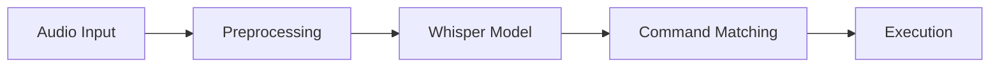

# Voice Command System

A sophisticated Python-based voice command system that leverages OpenAI's Whisper model for accurate speech recognition. This system provides a robust GUI for recording, training, and executing voice commands with advanced audio preprocessing and command matching algorithms.

## System Architecture

### 1. Speech Recognition Pipeline


### 2. Core Components
1. **Audio Processing Module** (`audio_recorder.py`)
   - Real-time audio capture
   - Signal preprocessing
   - Audio file management

2. **Command Recognition** (`model_trainer.py`)
   - Whisper model integration
   - Command vocabulary management
   - Multi-level matching algorithm

3. **Command Execution** (`command_executor.py`)
   - System command interface
   - Input simulation
   - Error handling

4. **User Interface** (`gui_modes.py`, `startup.py`)
   - Recording interface
   - Training dashboard
   - Deployment controls

## Features

- **Speech Recognition**: Uses OpenAI's Whisper model for accurate speech-to-text conversion
- **Command Recording**: Record individual or bulk voice commands with audio preprocessing
- **Command Training**: Train the system to recognize your voice commands
- **Command Execution**: Execute system commands like opening applications or closing windows
- **User-friendly GUI**: Three separate interfaces for recording, training, and testing
- **Audio Preprocessing**: Includes noise reduction, silence trimming, and volume normalization
- **GPU Acceleration**: CUDA support for faster speech recognition

## Requirements

### Hardware Requirements
- **CPU**: Intel i5/AMD Ryzen 5 or better
- **RAM**: 8GB minimum (16GB recommended)
- **GPU**: NVIDIA GPU with CUDA support (optional)
- **Storage**: 500MB for base installation
- **Microphone**: Any decent quality microphone

### Software Requirements
- **Operating System**: Windows 10/11
- **Python**: 3.8 or higher
- **CUDA Toolkit**: 11.8+ (for GPU acceleration)
- **Sound Drivers**: Updated Windows audio drivers

## Installation Guide

### 1. Environment Setup

1. **Clone Repository**
```bash
git clone https://github.com/daanishmittal24/voice_to_command.git
cd voice_to_command
```

2. **Create Virtual Environment**
```bash
python -m venv venv
venv\Scripts\activate
```

3. **Install Dependencies**
```bash
pip install -r requirements.txt
```

4. **Verify CUDA Installation** (if using GPU)
```bash
python -c "import torch; print(torch.cuda.is_available())"
```

### 2. Initial Configuration

1. **Audio Device Setup**
   - Open Windows Sound Settings
   - Select your microphone as default input device
   - Set input volume to ~70%

2. **Application Settings**
   - First run will create necessary directories
   - Default settings are optimized for most users
   - Configuration files are created in respective directories

## Usage Guide

### 1. Main Application

Three ways to run the application:

1. **Full Interface** (Recommended for first use)
```bash
python startup.py
```

2. **Classic Interface** (All features)
```bash
python main.py
```

3. **Minimal Interface** (Quick testing)
```bash
python minimal_run.py
```

### 2. Recording Voice Commands

#### A. Individual Recording
1. Select "Recording Mode"
2. Click "Press and Hold to Record"
3. Speak your command
4. Release to stop recording
5. Enter command text
6. Click "Save Recording"

#### B. Bulk Recording (Recommended)
1. Select "Bulk Recording"
2. Enter command name
3. Choose number of samples (20-30 recommended)
4. Follow the recording prompts
5. Verify recordings in the list

### 3. Training the System

1. **Data Preparation**
   - Ensure you have recorded commands
   - Recommended 20+ samples per command
   - Varied voice tones/speeds recommended

2. **Training Process**
   - Select "Training Mode"
   - Click "Start Training"
   - Monitor progress bar
   - Wait for completion message

3. **Model Validation**
   - System automatically validates
   - Check recognition accuracy
   - Retrain if accuracy is low

### 4. Using Voice Commands

1. **Testing Mode**
   - Select "Testing/Deployment Mode"
   - Click "Start Listening"
   - Speak commands
   - Monitor recognition results

2. **Production Use**
   - Use minimal_run.py for regular use
   - Commands execute automatically
   - Check status in log window

## Available Commands

Currently supported commands:
- `open notepad`: Opens Windows Notepad
- `open calculator`: Opens Windows Calculator
- `close window`: Closes the active window (Alt+F4)

## Technical Deep Dive

### 1. Audio Processing Pipeline

```python
def _preprocess_audio(self, audio_data):
    # Remove DC offset
    audio_data = audio_data - np.mean(audio_data)
    
    # Normalize volume
    audio_data = audio_data / np.max(np.abs(audio_data))
    
    # High-pass filter (reduce noise)
    nyquist = self.sample_rate / 2
    cutoff = 80  # Hz
    b, a = signal.butter(4, cutoff / nyquist, btype='highpass')
    audio_data = signal.filtfilt(b, a, audio_data)
    
    # Trim silence
    threshold = 0.01
    mask = np.abs(audio_data) > threshold
    audio_data = audio_data[start:end]
    
    return audio_data
```

### 2. Command Recognition Algorithm

The system uses a 3-tier matching approach:

1. **Exact Match**
   - Direct string comparison
   - Case-insensitive
   - Highest confidence

2. **Keyword Match**
   - Key term identification
   - Ignores common words
   - Medium confidence

3. **Fuzzy Match**
   - Partial string matching
   - Levenshtein distance
   - Minimum score threshold: 0.5

### 3. Performance Optimization

#### GPU Acceleration
```python
if torch.cuda.is_available():
    device = torch.device("cuda")
    model = model.to(device)
    # Enable mixed precision
    with torch.cuda.amp.autocast():
        results = model(inputs)
```

#### Memory Management
- Streaming audio recording
- Efficient buffer management
- Automatic cleanup of temporary files

## Project Structure

```
voice_to_command/
├── startup.py           # Main GUI application
├── model_trainer.py     # Whisper model handler
├── audio_recorder.py    # Audio recording/processing
├── command_executor.py  # Command execution logic
├── command_organizer.py # Data management
├── gui_modes.py        # GUI implementations
├── recordings/         # Raw audio storage
├── command_data/       # Processed commands
└── trained_models/     # Model checkpoints
```

## Troubleshooting Guide

### Common Issues

1. **No Audio Input**
   - Check microphone connections
   - Verify Windows permissions
   - Test with Windows Sound settings

2. **GPU Not Detected**
   - Verify CUDA installation
   - Update GPU drivers
   - Check `nvidia-smi` output

3. **Poor Recognition**
   - Reduce background noise
   - Speak clearly and consistently
   - Re-record training samples

4. **Command Execution Fails**
   - Check system permissions
   - Verify command paths
   - Check error logs

## Contributing

1. Fork the repository
2. Create feature branch
3. Implement changes
4. Add tests
5. Submit pull request

See [CONTRIBUTING.md](CONTRIBUTING.md) for detailed guidelines.

## License

MIT License - See [LICENSE](LICENSE) for details

## Acknowledgments

- OpenAI Whisper team for the base model
- PyTorch community
- Audio processing libraries:
  - SoundDevice
  - SciPy
  - NumPy
