# Voice Command System 🎤

[](https://www.python.org/downloads/)
[](https://developer.nvidia.com/cuda-downloads)
[](https://opensource.org/licenses/MIT)
[](https://github.com/psf/black)

> A sophisticated Python-based voice command system that leverages OpenAI's Whisper model for accurate speech recognition. Transform your voice into actions with advanced preprocessing and intuitive controls.

<p align="center">
  
</p>

## ✨ Key Features

🎯 **Accurate Speech Recognition**
- OpenAI Whisper model integration
- Multi-language support
- Real-time processing

🎚️ **Advanced Audio Processing**
- Noise reduction
- Automatic gain control
- Silence trimming
- High-pass filtering

🚀 **High Performance**
- GPU acceleration
- Efficient memory management
- Parallel processing support

🎮 **User-Friendly Interface**
- Intuitive GUI
- Real-time feedback
- Command history
- Status monitoring

## 🏗️ System Architecture

```mermaid
graph LR
    A[🎤 Audio Input] --> B[⚡ Preprocessing]
    B --> C[🧠 Whisper Model]
    C --> D[🎯 Command Matching]
    D --> E[⚙️ Execution]

```



## 📋 Requirements

### Hardware
| Component | Minimum | Recommended |
|-----------|---------|-------------|
| CPU | Intel i5/AMD Ryzen 5 | Intel i7/AMD Ryzen 7 |
| RAM | 8GB | 16GB |
| GPU | NVIDIA (Optional) | NVIDIA RTX Series |
| Storage | 500MB | 1GB |
| Microphone | Basic | High-quality |

### Software
| Requirement | Version | Purpose |
|------------|---------|----------|
| Python | 3.8+ | Runtime |
| CUDA Toolkit | 11.8+ | GPU Acceleration |
| Windows | 10/11 | Operating System |
| Sound Drivers | Latest | Audio Processing |

## 🚀 Quick Start

### 1️⃣ Installation

```bash
# Clone repository
git clone https://github.com/daanishmittal24/voice_to_command.git
cd voice_to_command

# Create virtual environment
python -m venv venv
venv\Scripts\activate

# Install dependencies
pip install -r requirements.txt
```

### 2️⃣ Configuration

1. **Audio Setup** 🎤
   ```
   Windows Settings → System → Sound → Input
   ```

2. **First Run** ⚙️
   ```bash
   python startup.py
   ```

### 3️⃣ Basic Usage

1. **Record Commands** 📝
   ```
   Recording Mode → New Command → Record → Save
   ```

2. **Train System** 🧠
   ```
   Training Mode → Select Data → Start Training
   ```

3. **Use Commands** 🎯
   ```
   Testing Mode → Start Listening → Speak Command
   ```

## 📚 Detailed Documentation

### Command Types

| Category | Examples | Description |
|----------|----------|-------------|
| System | `open calculator`, `close window` | System operations |
| Navigation | `scroll up`, `click` | Interface control |
| Custom | User-defined | Your custom actions |

### Voice Training Tips

✅ **Do**
- Record in your normal speaking voice
- Vary your speaking pace slightly
- Include background noise variations
- Record 20+ samples per command

❌ **Don't**
- Speak unnaturally slowly
- Record in perfect silence only
- Use inconsistent command phrases
- Skip the training phase

## 🔧 Advanced Configuration

### Audio Processing Parameters

```python
AUDIO_CONFIG = {
    'sample_rate': 16000,
    'chunk_size': 1024,
    'silence_threshold': 0.01,
    'noise_reduction': True,
    'high_pass_cutoff': 80  # Hz
}
```

### Model Configuration

```python
MODEL_CONFIG = {
    'model_size': 'tiny',
    'language': 'en',
    'compute_type': 'float16',
    'num_threads': 4
}
```

## 🔍 Troubleshooting

<details>
<summary>🔴 No Audio Input</summary>

1. Check physical connections
2. Test microphone in Windows
3. Verify app permissions
4. Update audio drivers
</details>

<details>
<summary>🔴 GPU Not Detected</summary>

1. Verify CUDA installation
2. Update NVIDIA drivers
3. Check `nvidia-smi` output
4. Confirm PyTorch CUDA build
</details>

<details>
<summary>🔴 Poor Recognition</summary>

1. Reduce background noise
2. Check microphone quality
3. Retrain with more samples
4. Verify audio settings
</details>

## 📈 Performance Tips

- Enable GPU acceleration
- Use batch processing
- Optimize audio settings
- Regular model updates
- Clean unused recordings

## 🤝 Contributing

We welcome contributions! Please see our [Contributing Guide](CONTRIBUTING.md) for details.

1. 🍴 Fork the repo
2. 🌿 Create a branch
3. 📝 Make changes
4. ✅ Run tests
5. 📫 Submit PR

## 📄 License

This project is licensed under the MIT License - see the [LICENSE](LICENSE) file for details.

## 🙏 Acknowledgments

- OpenAI Whisper team
- PyTorch community
- SoundDevice contributors
- SciPy developers
- NumPy team
