# Voice Command System 🎤

[](https://www.python.org/downloads/)
[](https://developer.nvidia.com/cuda-downloads)
[](https://opensource.org/licenses/MIT)
[](https://github.com/psf/black)

> A sophisticated Python-based voice command system that leverages OpenAI's Whisper model for accurate speech recognition. Transform your voice into actions with advanced preprocessing and intuitive controls.

<p align="center">
  
</p>

## ✨ Key Features

🎯 **Accurate Speech Recognition**
- OpenAI Whisper model integration with customizable model sizes
- Multi-language support with optimized English processing
- Real-time processing with continuous listening mode
- Adaptive voice activity detection

🎚️ **Advanced Audio Processing**
- Dynamic noise reduction with automatic ambient noise analysis
- Adaptive silence thresholding based on environment
- Intelligent voice activity detection
- High-pass filtering to eliminate low-frequency noise
- Audio preprocessing pipeline with configurable parameters

🚀 **High Performance**
- GPU acceleration with CUDA optimization
- Efficient memory management with streaming inference
- Parallel processing for command detection
- Command queuing system with priority handling

🎮 **User-Friendly Interface**
- Intuitive GUI with real-time visualization
- Multi-mode interface (Training, Testing, Recording)
- Detailed feedback and status monitoring
- Command history with success/failure tracking
- Custom command creation workflow

🎲 **Gaming & Productivity Integration**
- WASD movement controls (forward, back, left, right)
- Mouse click simulation for gaming actions
- Window management commands
- Application launching capabilities
- Web browser integration

## 🏗️ System Architecture

```mermaid
graph LR
    A[🎤 Audio Input] --> B[⚡ Preprocessing]
    B --> C[🧠 Whisper Model]
    C --> D[🎯 Command Matching]
    D --> E[⚙️ Execution]
    E --> F[🔄 Feedback Loop]
    F --> A
```



### Core Components

| Component | File | Description |
|-----------|------|-------------|
| **Audio Recorder** | `audio_recorder.py` | Captures audio input with advanced preprocessing |
| **Command Executor** | `command_executor.py` | Maps recognized speech to system actions |
| **Command Organizer** | `command_organizer.py` | Manages command libraries and patterns |
| **Command Queue** | `command_queue.py` | Handles command sequencing and priorities |
| **Model Trainer** | `model_trainer.py` | Fine-tunes the Whisper model on custom commands |
| **GUI Interface** | `gui_modes.py` | Provides user interface for system interaction |
| **Online Transcription** | `online_transcription.py` | Handles real-time speech processing |

## 📋 Requirements

### Hardware
| Component | Minimum | Recommended |
|-----------|---------|-------------|
| CPU | Intel i5/AMD Ryzen 5 | Intel i7/AMD Ryzen 7 |
| RAM | 8GB | 16GB |
| GPU | NVIDIA (Optional) | NVIDIA RTX Series |
| Storage | 500MB | 1GB |
| Microphone | Basic | High-quality with noise cancellation |

### Software
| Requirement | Version | Purpose |
|------------|---------|----------|
| Python | 3.8+ | Runtime |
| CUDA Toolkit | 11.8+ | GPU Acceleration |
| Windows | 10/11 | Operating System |
| Sound Drivers | Latest | Audio Processing |
| PyTorch | 2.0+ | Machine Learning Backend |

### Dependencies
```
numpy>=1.20.0
torch>=2.0.0
sounddevice>=0.4.5
scipy>=1.7.0
whisper>=1.0.0
pynput>=1.7.6
pyaudio>=0.2.11
matplotlib>=3.5.0
PyQt5>=5.15.0
```

## 🚀 Quick Start

### 1️⃣ Installation

```bash
# Clone repository
git clone https://github.com/daanishmittal24/voice_to_command.git
cd voice_to_command

# Create virtual environment
python -m venv venv
venv\Scripts\activate

# Install dependencies
pip install -r requirements.txt

# Install PyTorch with CUDA support (optional but recommended)
pip install torch torchvision torchaudio --index-url https://download.pytorch.org/whl/cu118
```

### 2️⃣ Configuration

1. **Audio Setup** 🎤
   * Ensure your microphone is connected and set as default input device
   ```
   Windows Settings → System → Sound → Input
   ```
   * Test microphone input levels and adjust sensitivity

2. **First Run Setup** ⚙️
   ```bash
   python startup.py
   ```
   This will:
   * Download the Whisper model (if not present)
   * Test audio input configuration
   * Verify CUDA availability
   * Create necessary directories

3. **System Configuration** ⚙️
   * Modify `config.py` (created after first run) to adjust:
     * Model size (`tiny`, `base`, `small`, `medium`, `large`)
     * Audio preprocessing parameters
     * Interface preferences

### 3️⃣ Basic Usage

1. **Launch Application** 🚀
   ```bash
   python main.py
   ```

2. **Record Commands** 📝
   ```
   Switch to Recording Mode → New Command → Record → Save
   ```
   * Record at least 15-20 samples per command
   * Vary your speaking style slightly between samples
   * Include some background noise in samples for robustness

3. **Train System** 🧠
   ```
   Switch to Training Mode → Select Training Data → Start Training
   ```
   * Training uses your recorded samples to optimize command recognition
   * Progress and metrics are displayed during training
   * Trained models are saved in the `trained_models` directory

4. **Use Commands** 🎯
   ```
   Switch to Testing Mode → Start Listening → Speak Command
   ```
   * Command execution feedback appears in the status area
   * Real-time visualization shows audio input and processing
   * Command history tracks successful and failed recognitions

5. **Minimal Mode** ⚡
   ```bash
   python minimal_run.py
   ```
   * Lightweight version for production use
   * No GUI overhead, just core functionality
   * Perfect for embedding in other applications

## 📚 Detailed Documentation

### Audio Processing Pipeline

```
┌────────────┐     ┌──────────────┐     ┌────────────────┐
│ Raw Audio  │ ──▶ │ Preprocessing │ ──▶ │ Voice Activity │
└────────────┘     └──────────────┘     │   Detection    │
                                        └────────────────┘
                                                │
┌────────────┐     ┌──────────────┐             ▼
│ Transcribed│ ◀── │   Whisper    │ ◀── ┌────────────────┐
│   Text     │     │    Model     │     │  Noise-reduced  │
└────────────┘     └──────────────┘     │     Audio       │
                                        └────────────────┘
```

* **Preprocessing**: High-pass filtering, normalization, and silence trimming
* **Voice Activity Detection**: Dynamic thresholding based on ambient noise
* **Noise Reduction**: Spectral gating and adaptive filtering
* **Model Inference**: Optimized for speed with proper batching

### Command System

The command system features a sophisticated queue architecture that enables:

* **Command Sequencing**: Execute commands in order with configurable delays
* **Priority Handling**: Critical commands can bypass the queue
* **Failure Recovery**: Automatic retry mechanisms for failed commands
* **Command Chaining**: Create complex actions from simple commands

#### Command Categories

| Category | Examples | Description |
|----------|----------|-------------|
| System | `open calculator`, `close window` | System operations |
| Navigation | `scroll up`, `click` | Interface control |
| Movement | `forward`, `back`, `left`, `right` | Gaming controls |
| Action | `attack`, `interact` | Gaming actions |
| Custom | User-defined | Your custom actions |

### Voice Training System

The voice training subsystem includes:

* **Data Augmentation**: Generates variations of your voice samples
* **Transfer Learning**: Fine-tunes the Whisper model on your specific commands
* **Validation**: Tests model accuracy with held-out samples
* **Incremental Training**: Add new commands without retraining everything

#### Voice Training Tips

✅ **Do**
- Record in your normal speaking voice and position
- Vary your speaking pace slightly between samples
- Include background noise variations for robustness
- Record at least 20 samples per command
- Use a consistent distance from the microphone
- Include samples recorded when tired or excited

❌ **Don't**
- Speak unnaturally slowly or with exaggerated pronunciation
- Record in perfect silence only (system won't be robust)
- Use inconsistent command phrases or wording
- Skip the training phase (critical for accuracy)
- Hold the microphone too close or too far away
- Train in one environment but use in another

## 🔧 Advanced Configuration

### Audio Processing Parameters

```python
AUDIO_CONFIG = {
    'sample_rate': 16000,          # Sample rate in Hz
    'chunk_size': 1024,            # Audio processing chunk size
    'silence_threshold': 0.01,     # Threshold for silence detection
    'noise_reduction': True,       # Enable noise reduction
    'high_pass_cutoff': 80,        # High-pass filter cutoff frequency (Hz)
    'vad_frame_duration': 0.03,    # Voice activity detection frame size (s)
    'min_speech_duration': 0.3,    # Minimum speech duration to process (s)
    'dynamic_threshold': True,     # Use dynamic thresholding for VAD
    'energy_window': 20            # Window size for energy calculation
}
```

### Model Configuration

```python
MODEL_CONFIG = {
    'model_size': 'tiny',          # Model size (tiny, base, small, medium, large)
    'language': 'en',              # Target language
    'compute_type': 'float16',     # Compute precision (float16, float32)
    'num_threads': 4,              # CPU threads for processing
    'use_gpu': True,               # Enable GPU acceleration
    'beam_size': 5,                # Beam search size for decoding
    'best_of': 5,                  # Number of candidates to generate
    'temperature': [0.0, 0.2, 0.4],# Temperature for sampling
    'compression_ratio_threshold': 2.4, # Audio compression ratio threshold
    'logprob_threshold': -1.0,     # Log probability threshold for filtering
    'no_speech_threshold': 0.6,    # Threshold for "no speech" detection
}
```

### Command Queue Configuration

```python
QUEUE_CONFIG = {
    'default_delay': 0.1,          # Default delay between commands (s)
    'max_queue_size': 20,          # Maximum number of queued commands
    'priority_levels': 3,          # Number of priority levels
    'auto_retry': True,            # Automatically retry failed commands
    'retry_delay': 0.5,            # Delay before retrying (s)
    'max_retries': 2               # Maximum number of retries
}
```

### GUI Configuration

```python
GUI_CONFIG = {
    'theme': 'dark',               # UI theme (dark, light)
    'visualization': True,         # Enable audio visualization
    'command_history_size': 20,    # Number of commands to show in history
    'waveform_update_rate': 30,    # Waveform update rate (Hz)
    'spectrum_analysis': True,     # Show spectrum analysis
    'show_confidence': True        # Show confidence scores for recognition
}
```

## 🔍 Troubleshooting

<details>
<summary>🔴 No Audio Input Detected</summary>

1. Check physical connections and ensure microphone is properly connected
2. Test microphone in Windows Sound settings:
   ```
   Settings → System → Sound → Input → Test your microphone
   ```
3. Verify app permissions:
   ```
   Settings → Privacy → Microphone → Allow apps to access your microphone
   ```
4. Update audio drivers from device manufacturer's website
5. Try a different USB port if using an external microphone
6. Run the diagnostic tool:
   ```
   python tools/audio_diagnostic.py
   ```
</details>

<details>
<summary>🔴 GPU Not Detected or Not Used</summary>

1. Verify CUDA installation:
   ```
   python -c "import torch; print(torch.cuda.is_available())"
   ```
2. Update NVIDIA drivers to latest version
3. Check `nvidia-smi` output in terminal to confirm GPU is visible
4. Confirm PyTorch CUDA build is compatible:
   ```
   python -c "import torch; print(torch.version.cuda)"
   ```
5. Ensure no other applications are using all GPU memory
6. Try setting specific GPU device:
   ```
   python main.py --gpu 0
   ```
</details>

<details>
<summary>🔴 Poor Recognition Accuracy</summary>

1. Reduce background noise in your environment
2. Check microphone quality and positioning
3. Retrain with more diverse samples (at least 20-30 per command)
4. Verify audio settings match your microphone capabilities
5. Try a larger model size:
   ```
   python main.py --model-size base
   ```
6. Clean your training data:
   ```
   python tools/clean_training_data.py
   ```
7. Optimize command phrases to be more distinct from each other
</details>

<details>
<summary>🔴 System Running Slowly</summary>

1. Enable GPU acceleration if available
2. Use a smaller model size:
   ```
   python main.py --model-size tiny
   ```
3. Optimize audio settings:
   ```
   python main.py --chunk-size 512 --sample-rate 16000
   ```
4. Close other resource-intensive applications
5. Reduce visualization features:
   ```
   python main.py --disable-visualization
   ```
6. Use minimal mode for production:
   ```
   python minimal_run.py
   ```
</details>

<details>
<summary>🔴 Commands Being Triggered Accidentally</summary>

1. Increase the confidence threshold:
   ```
   python main.py --confidence-threshold 0.75
   ```
2. Train with more negative samples:
   ```
   python tools/generate_negative_samples.py
   ```
3. Use more distinct command phrases
4. Enable command confirmation mode:
   ```
   python main.py --confirm-commands
   ```
5. Implement a trigger word/phrase:
   ```
   python main.py --trigger-word "computer"
   ```
</details>

## 📈 Performance Optimization Tips

- **Enable GPU Acceleration**: Use CUDA for significant speedups
  ```bash
  python main.py --use-gpu
  ```

- **Optimize Model Size**: Balance accuracy vs. speed
  ```bash
  python main.py --model-size base  # More accurate but slower
  python main.py --model-size tiny  # Less accurate but faster
  ```

- **Batch Processing**: Process multiple commands in batches
  ```bash
  python main.py --batch-size 4
  ```

- **Audio Setting Tuning**: Adjust for your specific hardware
  ```bash
  python main.py --sample-rate 16000 --chunk-size 1024
  ```

- **Clean Unused Data**: Free up disk space
  ```bash
  python tools/cleanup_old_recordings.py
  ```

- **Memory Management**: Use streaming for large audio files
  ```bash
  python main.py --streaming-mode
  ```

## 🔮 Advanced Usage Examples

### Command Chaining

Create complex sequences of actions:

```python
# In command_organizer.py:
command_chains = {
    "open browser and search": ["open google search", "wait 2", "click"],
    "prepare for gaming": ["open game launcher", "wait 5", "click", "wait 10", "click"]
}
```

### Custom Command Templates

```python
# In command_executor.py:
def register_custom_command(name, keys=None, mouse_action=None, app_path=None):
    """Register a custom command with keyboard, mouse, or application actions"""
    # Implementation details...
    
# Usage:
register_custom_command("select all", keys=["ctrl", "a"])
register_custom_command("right click", mouse_action="right_click")
register_custom_command("open spotify", app_path="C:/Path/To/Spotify.exe")
```

### Environment-Specific Commands

```python
# In command_organizer.py:
environments = {
    "gaming": ["forward", "back", "left", "right", "attack"],
    "office": ["open notepad", "close window", "scroll up", "scroll down"],
    "browser": ["scroll up", "scroll down", "refresh page", "new tab"]
}

# Usage:
switch_environment("gaming")  # Only gaming commands are active
```

## 🤝 Contributing

We welcome contributions! Please see our [Contributing Guide](CONTRIBUTING.md) for details.

1. 🍴 Fork the repo
2. 🌿 Create a branch (`git checkout -b feature/amazing-feature`)
3. 📝 Make changes and test thoroughly
4. ✅ Run verification checks (`python tools/verify.py`)
5. 📫 Submit PR with comprehensive description

### Development Setup

```bash
# Set up dev environment
python -m venv venv
venv\Scripts\activate
pip install -r requirements-dev.txt

# Run tests
pytest tests/

# Check code style
black .
flake8

# Generate documentation
sphinx-build -b html docs/source docs/build
```

## 📄 License

This project is licensed under the MIT License - see the [LICENSE](LICENSE) file for details.

## 🙏 Acknowledgments

- OpenAI Whisper team for the incredible speech recognition model
- PyTorch community for the deep learning framework
- SoundDevice contributors for the audio processing capabilities
- SciPy developers for signal processing algorithms
- NumPy team for numerical computing foundations
- The open source community for various libraries and tools
- All contributors who have helped improve this system
